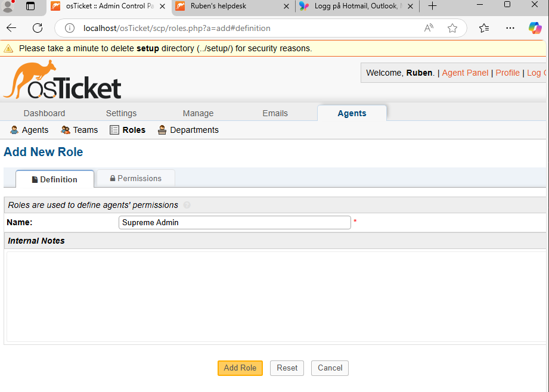
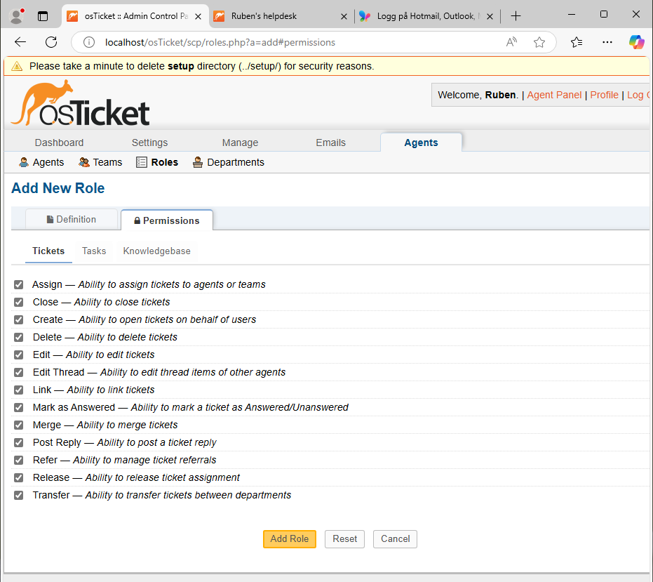
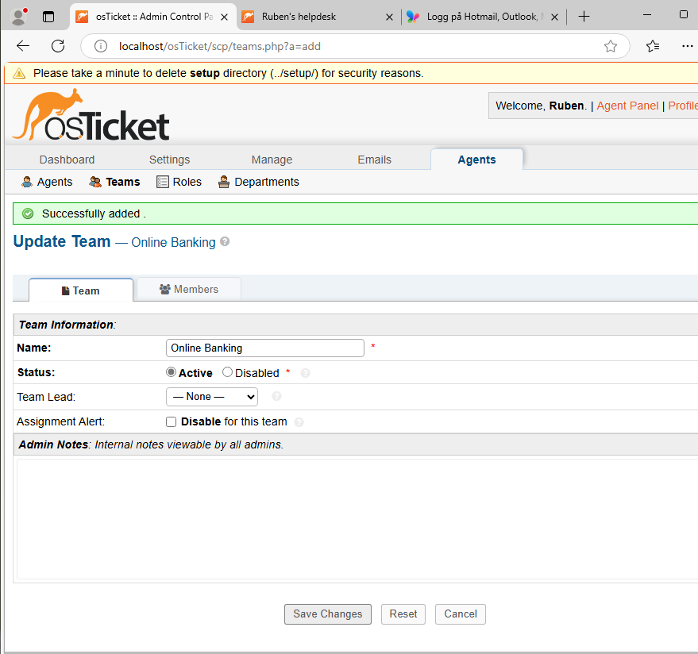
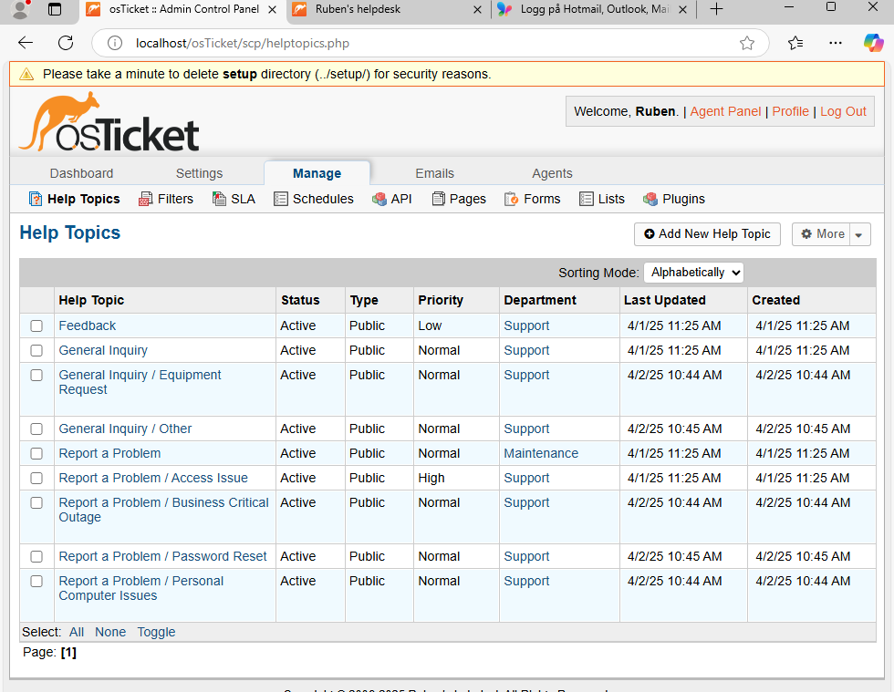
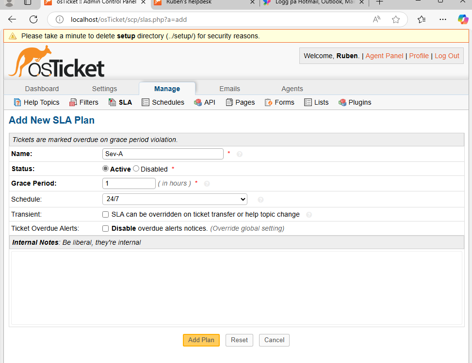
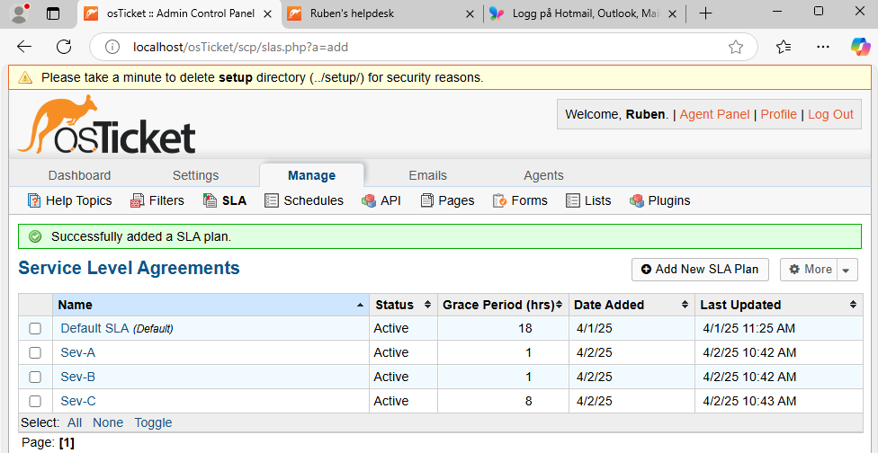

post-install-config-

<h1>osTicket - Post-Install Configuration</h1>
This tutorial outlines the post-install configuration of the open-source help desk ticketing system osTicket. 

osTicket Configuration

Once osTicket is installed, follow these steps to configure the system for real-world use.

---

Access URLs

- Admin / Analyst Login Page:  
  [http://localhost/osTicket/scp/login.php](http://localhost/osTicket/scp/login.php)

- End User Portal: 
  [http://localhost/osTicket](http://localhost/osTicket)

---

Understand Panels

- Admin Panel: Full system configuration  
- Agent Panel: Where agents manage and respond to tickets

---

 Roles

> Roles control permissions assigned to agents.

- Navigate to:  
  `Admin Panel → Agents → Roles`
- Create Role:  
  `Supreme Admin`

---

Departments

> Departments control ticket visibility.

- Navigate to:  
  `Admin Panel → Agents → Departments`
- Examples:
  - `SysAdmins`
  - `Help Desk`
  - `Networking`

---

Teams

> Teams allow grouping of agents across departments.

- Navigate to:  
  `Admin Panel → Agents → Teams`
- Example Team:  
  `Online Banking`

---

User Ticket Settings

- Navigate to:  
  `Admin Panel → Settings → User Settings`

- Configure:
  - ✅ **Require registration and login to create tickets**
  - 🔲 **Uncheck "unregistered users can create tickets"**

---

Configure Agents

> Agents are your helpdesk workers or IT staff.

- Navigate to:  
  `Admin Panel → Agents → Add New`

- Add:
  - `Jane` (Dept: SysAdmins)
  - `John` (Dept: Support)

---

Configure Users

> Users are your end customers.

- Navigate to:  
  `Agent Panel → Users → Add New`

- Add:
  - `Karen`
  - `Ken`

---

Configure SLA (Service Level Agreements)

> SLAs define how fast issues must be addressed.

- Navigate to:  
  `Admin Panel → Manage → SLA`

- Configure:
  - `Sev-A`: 1 hour (Schedule: 24/7)
  - `Sev-B`: 4 hours (Schedule: 24/7)
  - `Sev-C`: 8 hours (Schedule: Business Hours)

---

Configure Help Topics

> Help topics guide users when submitting tickets.

- Navigate to:  
  `Admin Panel → Manage → Help Topics`

- Add:
  - Business Critical Outage  
  - Personal Computer Issues  
  - Equipment Request  
  - Password Reset  
  - Other

---

